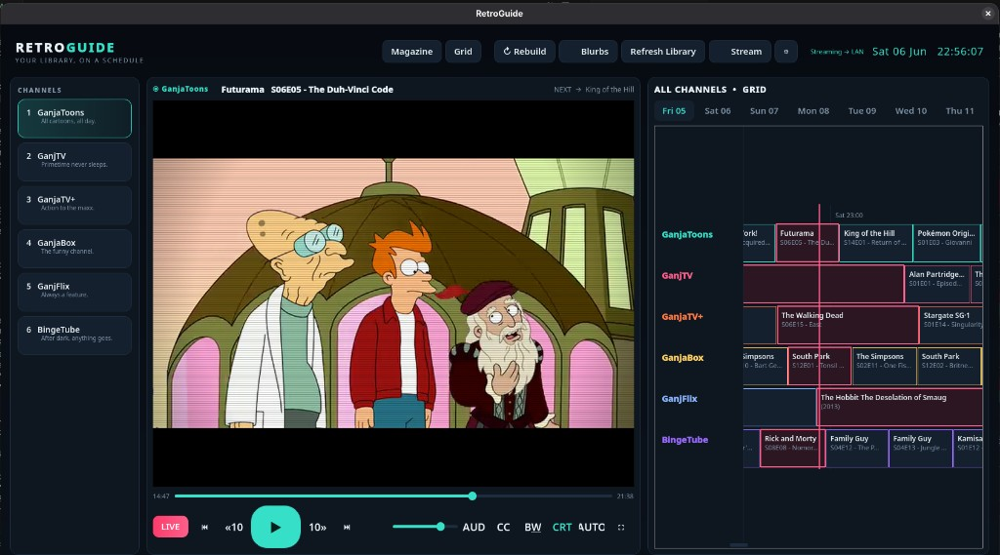

# RetroGuide

A local-AI powered **retro TV guide** for your own media library. Point it at
your TV and movie drives and it programs a full week of channels the way
television *used to feel* — Saturday-morning cartoons, after-school toons,
primetime drama, an evening film, and late-night adult animation — then plays it
all in an embedded **mpv** player. The "playlist" *is* the schedule: jump to any
day/time, or hit **LIVE** and tune in mid-broadcast like the old days.

Everything runs on your machine. A local **Ollama** model writes spoiler-free,
90s-TV-Guide-style blurbs; free **TVmaze** metadata (no key, no billing) fills in
accurate plots, cast, genres and episode titles. No subscriptions, no ads, no
reruns, no licensing — and it grows on its own as you add to your collection.

> Why it's good: it merges on-demand viewing with scheduled programming, but
> drops the bad parts of both — no ads, no waiting for next season, no
> subscriptions, no "not available in your region". You don't manage a watch
> list; new files just get woven into the schedule over time.



## Features

- **Indexer** — walks your drives, untangles messy scene-release names with
  `guessit`, reads real runtimes/codecs with `ffprobe`, caches to SQLite.
- **Free enrichment** — **TVmaze** metadata for TV (no key/billing), optional
  TMDB for films if you have a key, plus a local LLM that rewrites synopses into
  punchy, spoiler-free retro listings. Works fully offline if nothing's reachable.
- **Six themed channels** — ToonWorld, Prime, Maxx, Chuckle, The Movie Channel
  and Nite Owl, each with day-part templates that differ weekday vs weekend. TV
  shows advance **episode by episode** across the week via a persistent
  per-series playhead, and each series sticks to one channel so progression
  stays sequential and shows don't duplicate across channels.
- **Special events** — seasonal & spontaneous stunts take over The Movie Channel
  (Christmas cinema, a May-4th Star Wars bonanza, a Marvel origins weekend…),
  driven by automatic franchise/holiday tagging. Toggle in config.
- **Embedded player** — libmpv with full transport, autoplay to the next
  program, a **LIVE** button that seeks into whatever should be airing now,
  fullscreen/aspect controls, **audio-track selection** (defaults to English),
  **subtitles** toggle, and per-era **CRT** + **black-&-white** picture effects.
- **Two guide views** — the classic vertical "TV Guide magazine" listing
  (`time — Title: subtitle / blurb`) and a horizontal grid EPG, both live.
- **LAN + remote streaming** — broadcast your channels to any browser on the
  network (or anywhere, over Tailscale/VPN). HLS for Apple devices, low-latency
  MP4 for everyone else. See [Watch from another device](#watch-from-another-device).
- **Retro skins** — 70s / 80s / 90s / 00s eras with CRT scanlines and an
  orthogonal B&W toggle, on both desktop and the web view.

## Requirements

- Linux with an X11 or XWayland display (for the desktop app)
- Python 3.12+ (tested on 3.14)
- `ffmpeg`/`ffprobe` and `mpv`/`libmpv`
- [Ollama](https://ollama.com) running locally with a chat model (defaults to
  `mistral-small3.2`) and `nomic-embed-text` — optional but recommended

## Install (one command)

```bash
git clone https://github.com/mudkippzs/retroguide.git
cd retroguide
./install.sh
```

`install.sh` detects your package manager (dnf / apt / pacman / zypper / brew),
installs `ffmpeg` + `mpv`, creates a virtualenv, installs the Python
requirements, and seeds `config.toml`. It's safe to re-run.

<details>
<summary>Manual install</summary>

```bash
sudo dnf install ffmpeg mpv mpv-libs     # or apt/pacman/zypper equivalents
python3 -m venv .venv
./.venv/bin/python -m pip install -r requirements.txt
cp config.example.toml config.toml
```
</details>

## Point it at your media

Edit **`config.toml`** and set your library roots — one or more folders each:

```toml
[library]
tv_roots    = ["/mnt/tv", "/mnt/tv2"]     # folders of TV shows
movie_roots = ["/mnt/movies"]             # folders of films
```

These can be local paths or mounted network shares (NFS/CIFS). RetroGuide reads
your files; it never moves or modifies them. Optional tuning lives right below
in the same section (`video_extensions`, `exclude_patterns`, `min_file_mb`).

(Optional) for retro blurbs and the best classification, have Ollama running:

```bash
ollama pull mistral-small3.2
ollama pull nomic-embed-text
```

## Run

```bash
./run.sh
```

On first launch hit **Build my TV** to run the whole pipeline
(scan → probe → enrich → schedule). After that, use the top-bar buttons:

- **↻ Rebuild** — reprogram the week (continues each series where it left off)
- **✨ Blurbs** — have the local model write retro teasers for the week
- **Refresh Library** — rescan drives for new files
- **⚙ Settings** — library paths, channel names/logos, era/CRT/B&W, streaming
- **Stream** — start the LAN broadcast server

## Watch from another device

Hit **Stream** in the app (or run `./.venv/bin/python -m tvguide.cli serve`) and
open the printed URL in any browser on your LAN. You join **whatever is airing
right now**, just like real TV, with an in-page guide and channel switcher.

- **Apple devices** (iPhone/iPad/Mac Safari) get native **HLS**.
- **Everything else** (Chrome/Firefox/Android) gets a lower-latency MP4 stream.
- **From anywhere:** put [Tailscale](https://tailscale.com) on the host and your
  device, then open `http://<host-tailscale-ip>:8722/` — your whole library,
  scheduled like TV, in an airport lounge on the other side of the world.

Streaming is capped (`[stream] max_streams`, default 4 concurrent transcodes) so
a flaky client can't overrun the host.

### Command line

The same pipeline is scriptable:

```bash
./.venv/bin/python -m tvguide.cli scan      # build the catalog
./.venv/bin/python -m tvguide.cli probe     # read runtimes (slow)
./.venv/bin/python -m tvguide.cli enrich    # TVmaze/TMDB + buckets + tags
./.venv/bin/python -m tvguide.cli schedule  # program the week
./.venv/bin/python -m tvguide.cli blurbs    # LLM retro teasers
./.venv/bin/python -m tvguide.cli serve     # LAN/remote stream server
./.venv/bin/python -m tvguide.cli stats
```

## Configuration notes

- **Broadcast day** starts at `schedule.day_start_hour` (default 6am), so
  late-night content belongs to the previous day's listings.
- **Channels** can be renamed and given logo bugs under `[channels]` /
  `[channel_logos]`; their day-parts are defined in `tvguide/schedule/dayparts.py`.
- The catalog/schedule live in a SQLite DB under your platform data dir
  (e.g. `~/.local/share/RetroGuide/retroguide.db`); logs sit alongside it.

## How it fits together

```
drives ──▶ scan (guessit) ──▶ probe (ffprobe) ──▶ catalog (SQLite)
                                                      │
                          TVmaze/TMDB + Ollama ──▶ enrich (overviews, buckets,
                                                      │       tags, blurbs)
                                          scheduler ──▶ programs (7-day grid)
                                                      │
                            PySide6 UI + libmpv ──▶ watch  ──┐
                                                      │       ├──▶ LAN / Tailscale
                                       stream server ──▶ HLS + MP4 to any browser
```

## License

RetroGuide is released under the **[PolyForm Noncommercial License 1.0.0](LICENSE)**.
You're welcome to use, fork, and modify it for any **noncommercial** purpose
(personal use, hobby projects, learning, charities/schools). Commercial use
requires a separate license from the author. Copyright © 2026 mudkippzs.
